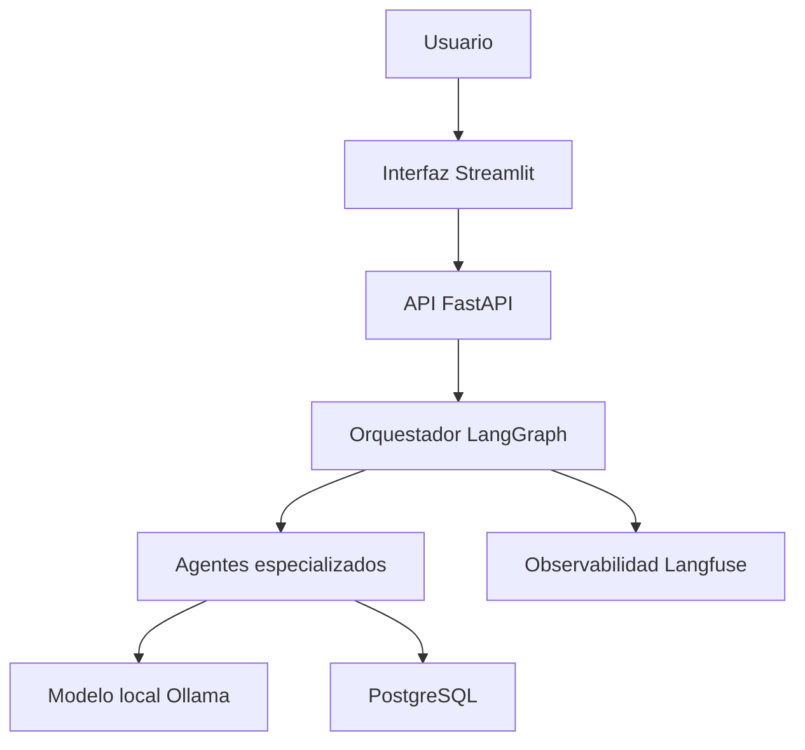

# Arquitectura del sistema

## Enfoque arquitectónico

El sistema utiliza una arquitectura de monolito modular contenedorizado. Los componentes se mantienen separados por responsabilidad, pero se integran inicialmente en una única solución para facilitar el desarrollo, las pruebas y la reproducibilidad del prototipo académico.

## Componentes

| Componente | Tecnología | Responsabilidad |
|---|---|---|
| Interfaz web | Streamlit | Carga de contratos y visualización de resultados |
| API | FastAPI | Exposición de endpoints y validación de solicitudes |
| Orquestador | LangGraph | Coordinación del flujo entre agentes |
| Agentes | Python y LangGraph | Extracción, procesamiento, análisis y clasificación |
| Modelo local | Ollama y qwen3:4b | Inferencia mediante lenguaje natural |
| Persistencia | PostgreSQL y SQLAlchemy | Almacenamiento de contratos y resultados |
| Herramientas | MCP | Exposición controlada de capacidades |
| Observabilidad | Langfuse | Registro de trazas, latencia y evaluaciones |
| Infraestructura | Docker Compose y Traefik | Contenedores y enrutamiento de servicios |

## Flujo general

## Organización modular

- `api`: rutas y controladores HTTP.
- `agents`: agentes especializados y coordinación.
- `core`: configuración y elementos compartidos.
- `db`: persistencia y modelos de base de datos.
- `schemas`: estructuras de entrada y salida.
- `services`: lógica de aplicación e integraciones.
- `llm`: comunicación con Ollama y los modelos de lenguaje.
- `mcp`: definición de herramientas mediante MCP.

## Principios de diseño

- Separación de responsabilidades.
- Bajo acoplamiento entre componentes.
- Configuración externa mediante variables de entorno.
- Trazabilidad de las operaciones con modelos de lenguaje.
- Pruebas unitarias y de integración.
- Reproducibilidad mediante contenedores.
- Desarrollo incremental gestionado con Scrum.

